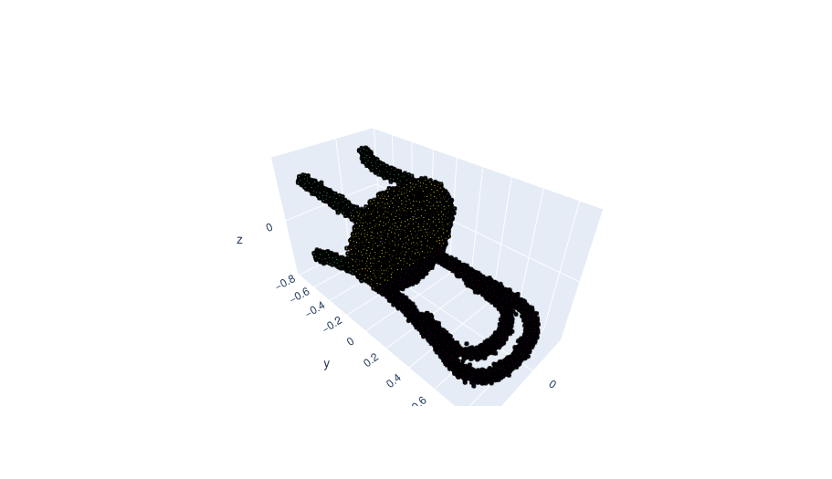

## Vizualization of Pointnet part segmentation 

model trained on partnet dataset : chair categor level 1 

Part Name List:  [
- chair/chair_head,
- chair/chair_back, 
- chair/chair_arm, 
- chair/chair_base,
- chair/chair_seat ]

.png)

 

.png)

.png)

.png)

