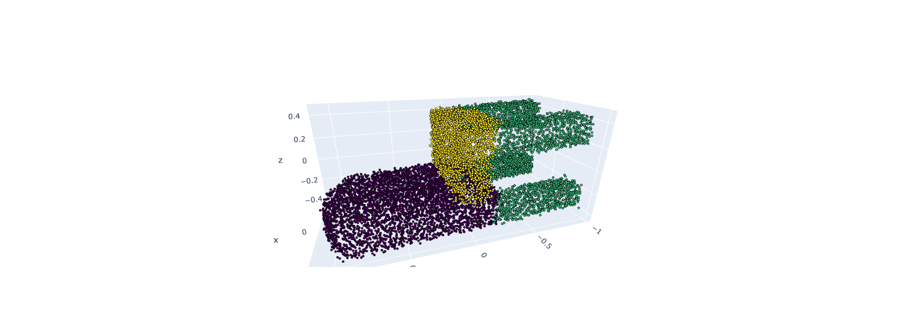

## Visualization of Pointnet part segmentation 

model trained on partnet dataset: category chair level 1 

Part Name List:  [
- chair/chair_head,
- chair/chair_back, 
- chair/chair_arm, 
- chair/chair_base,
- chair/chair_seat ]

#### part segmentation result:

Exp1             | Exp2
:-------------------------:|:-------------------------:
 |  


#### part instance segmentation result:


 


### per instance visualisation:
```
n_instances=0
for i in range(0,200):
   gt_instance=batch['masks'][1][i].float()
   n=np.unique(gt_instance.ravel()).size
   if n>1:
     n_instances+=1
n_instances
```
total instaces are 3 

 
 
 

=>the 4 legs are in the same instace


