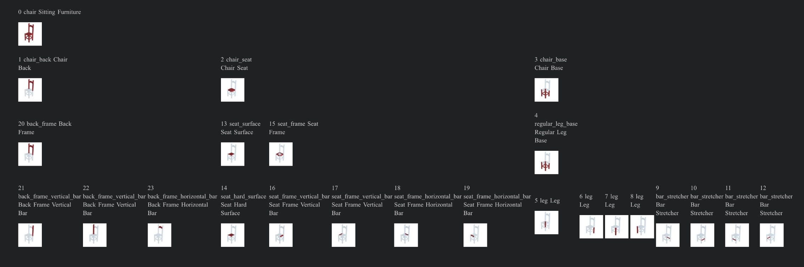

## Visualization of Pointnet part segmentation 

model trained on partnet dataset: category chair



## Level 1 

```
Part Name List:  [
- chair/chair_head,
- chair/chair_back, 
- chair/chair_arm, 
- chair/chair_base,
- chair/chair_seat ]
```

#### 1. part segmentation result:

Exp1             | Exp2
:-------------------------:|:-------------------------:
 |  


#### 2. part instance segmentation result:

Exp1             | Exp2
:-------------------------:|:-------------------------:
 |   

### 3. per instance gt visualisation:
1. 
```
n_instances=0
for i in range(0,200):
   gt_instance=batch['masks'][1][i].float()
   n=np.unique(gt_instance.ravel()).size
   if n>1:
     n_instances+=1
n_instances
```
total instaces are 3 


instance1             | instance2             | instance3 
:-------------------------:|:-------------------------:|:-------------------------:
 |    |   

=>the 4 legs are in the same instace

2.

total instaces are 5

instance1             | instance2             | instance3 
:-------------------------:|:-------------------------:|:-------------------------:
 |    |   

instance4             | instance5             
:-------------------------:|:-------------------------:
 |    

## Level-3
```
Part Name List:  [
3 chair/chair_head/headrest leaf
4 chair/chair_head/head_connector leaf
7 chair/chair_back/back_surface/back_surface_vertical_bar leaf
8 chair/chair_back/back_surface/back_surface_horizontal_bar leaf
9 chair/chair_back/back_surface/back_single_surface leaf
10 chair/chair_back/back_connector leaf
11 chair/chair_back/back_support leaf
13 chair/chair_back/back_frame/back_frame_vertical_bar leaf
14 chair/chair_back/back_frame/back_frame_horizontal_bar leaf
15 chair/chair_back/back_frame/back_holistic_frame leaf
17 chair/chair_arm/arm_sofa_style leaf
18 chair/chair_arm/arm_horizontal_bar leaf
19 chair/chair_arm/arm_near_vertical_bar leaf
20 chair/chair_arm/arm_writing_table leaf
21 chair/chair_arm/arm_holistic_frame leaf
22 chair/chair_arm/arm_connector leaf
27 chair/chair_base/star_leg_base/star_leg_set/caster/wheel leaf
28 chair/chair_base/star_leg_base/star_leg_set/caster/caster_stem leaf
29 chair/chair_base/star_leg_base/star_leg_set/leg leaf
30 chair/chair_base/star_leg_base/central_support leaf
32 chair/chair_base/star_leg_base/mechanical_control/knob leaf
33 chair/chair_base/star_leg_base/mechanical_control/lever leaf
35 chair/chair_base/regular_leg_base/foot leaf
36 chair/chair_base/regular_leg_base/runner leaf
37 chair/chair_base/regular_leg_base/bar_stretcher leaf
38 chair/chair_base/regular_leg_base/rocker leaf
39 chair/chair_base/regular_leg_base/leg leaf
41 chair/chair_base/foot_base/foot leaf
43 chair/chair_base/pedestal_base/pedestal leaf
44 chair/chair_base/pedestal_base/central_support leaf
46 chair/chair_seat/seat_support leaf
48 chair/chair_seat/seat_frame/seat_holistic_frame leaf
49 chair/chair_seat/seat_frame/seat_frame_bar leaf
51 chair/chair_seat/seat_surface/seat_surface_bar leaf
52 chair/chair_seat/seat_surface/seat_single_surface leaf
54 chair/footrest/chair_base leaf
56 chair/footrest/chair_seat/seat_support leaf
57 chair/footrest/chair_seat/seat_surface leaf
]
```
### part instance predictions:

#### I) good predictions:

1.

instance1             | instance2             | instance3 
:-------------------------:|:-------------------------:|:-------------------------:
.png) |  .png)  |  .png) 

instance4             | instance5              | instance6         
:-------------------------:|:-------------------------:|:-------------------------:
.png) |  .png)  |   .png)

instance7             | instance8              | instance9        
:-------------------------:|:-------------------------:|:-------------------------:
.png) |  .png)  |   .png)

instance10             | instance11              | instance12       
:-------------------------:|:-------------------------:|:-------------------------:
.png) |  .png)  |   .png)

instance13             |         
:-------------------------:|
.png) | 

2.

 

instance1             | instance2             | instance3 
:-------------------------:|:-------------------------:|:-------------------------:
 |    |   

instance4             | instance5              | instance6         
:-------------------------:|:-------------------------:|:-------------------------:
 |    |   

#### II) medium predictions:

##### predictions:

.png) 

instance1             | instance2             | instance3 
:-------------------------:|:-------------------------:|:-------------------------:
.png) |  .png)  |  .png) 

instance4             | instance5              | instance6         
:-------------------------:|:-------------------------:|:-------------------------:
.png) |  .png)  |   .png)

instance7             | instance8              | instance9        
:-------------------------:|:-------------------------:|:-------------------------:
.png) |  .png)  |   .png)

instance10             | instance11                    
:-------------------------:|:-------------------------:
.png) |  .png)  


##### GT:

instance1             | instance2             | instance3 
:-------------------------:|:-------------------------:|:-------------------------:
.png) |  .png)  |  .png) 

instance4             | instance5              | instance6         
:-------------------------:|:-------------------------:|:-------------------------:
.png) |  .png)  |   .png)

instance7             | instance8              | instance9        
:-------------------------:|:-------------------------:|:-------------------------:
.png) |  .png)  |   .png)


